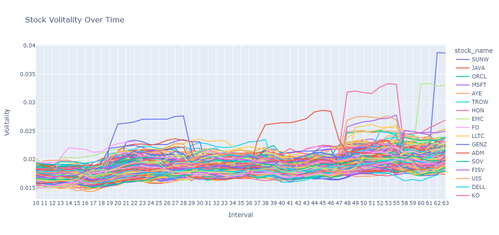
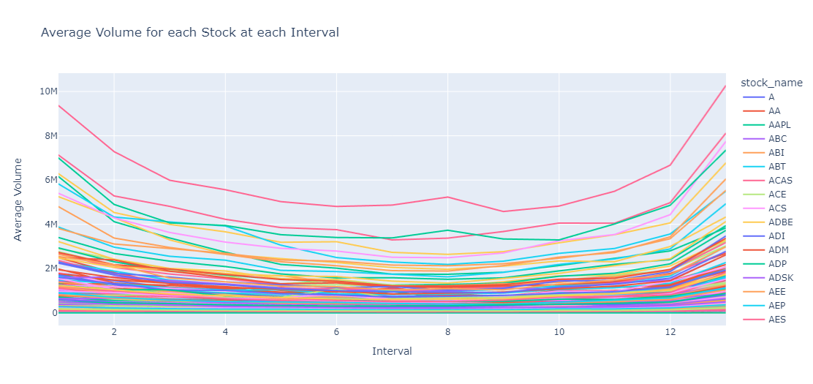

## VWAP-Model

## Description

This project aims to develop a pricing strategy for a guaranteed VWAP execution for algorithmic trading and quantitative strategies. The model is mostly inspired by Almgren-Chriss's "Optimal Execution in Portfolio Transactions"

## Objective

The main objective is to calculate the risk-adjusted cost of a guaranteed VWAP execution. The cost consists of a the expected execution cost and the variance of the spread cost times the risk aversion parameter. Our project first solved for the optimal trading trajectory to minimize the expected risk-adjusted cost of execution and then used a multiple linear regression to construct a volume model. Combined, we solve for the risk-adjusted cost of the execution. 

## Data

- Utilizes the TAQ dataset, focusing on a subset of S&P 500 stocks for liquidity.
- Uses average daily value traded instead of average daily volume traded to account for stock splits.
- Data processing involves computing various metrics such as mid-quote returns, total daily value, arrival price, and terminal price.

## Methodology
1. Solved for the optimal trading trajectory to minimize the expected risk-adjusted cost of execution.
2. Using a multiple linear regression to construct a volume model.
3. Using the input from the volume model, we compute the risk-adjusted cost of the execution.

The details of the solution are in optimal_execution.ipynb

## Results
The result is a set of pricing scripts available in the [Guaranteed_VWAP_Pricing.ipynb](https://github.com/ssnyu/VWAP-Model/blob/main/Guaranteed_VWAP_Pricing.ipynb)

The unit tests for the functions used in optimal execution and calculating the cost are in test_execution.py

## Team Members

- [Shubham Singh](https://github.com/shubhamcodez) NetID: sks9437
- [Tianqi Wang](https://github.com/foggyleo) NetID: tw2250

## Supplementary 

### Directory structure - [Directory.ReadME](https://github.com/ssnyu/Market-Impact-Model/blob/main/Directory.md)

### Volitality of stocks over time

### Volume of stocks over time

